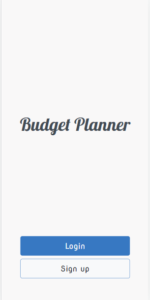
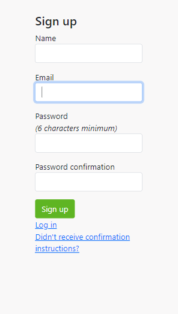
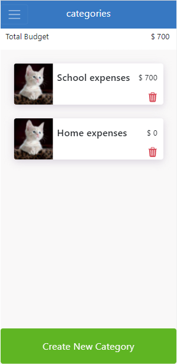

# budget-planner

> This helps users to plan several budgets which can be grouped into categories, Users can create new categories of which they can make a budget plan, by clicking on a category a user can create a new item with the amount they want to allocate for that item.

Mobile Landing page                      |  Mobile sign up
:---------------------------------------:|:---------------------------------------:
            |  

Mobile Categories page                   |  Mobile Items page
:---------------------------------------:|:---------------------------------------:
      |  

## Built With

- Ruby
- Rails

# Pre-requirements

- Vscode/Atom
- Ruby
- Rails
- Nodejs
- Yarn
- Sqlite3
- Postgresql
- Git

## demo

[heroku](https://immense-bastion-80345.herokuapp.com/)

## Live Video
[video](https://drive.google.com/file/d/1YOZ49dNsx4FZPsfTDk29yt1i9S-czAqf/view?usp=sharing)

## Getting Started

To get a local copy up and running follow these simple example steps.

- copy this link `https://github.com/xtrahuman/budget-planner.git`.
- get the directory that you want to clone the repository.
- open the command prompt in this directory.
- write `git clone https://github.com/xtrahuman/budget-planner.git`.
- go to the repository folder in your command prompt.
- run `bundle install`.
- create your database `rails db:create`
- Migrate database `rails db:migrate`
- type `rails s` to start up server

## Testing with Rspec and Capybara

- test views `bundle exec rspec spec/views`
- test controllers `bundle exec rspec spec/controllers`

## Author

👤 **Okpara Tochukwu**

- GitHub: [@xtrahuman](https://github.com/xtrahuman)
- LinkedIn: [LinkedIn](https://linkedin.com/in/tochukwuokpara)

## 🤝 Contributing

Contributions, issues, and feature requests are welcome!

Feel free to check the [issues page](../../issues/).

## Show your support

Give a ⭐️ if you like this project!

## Acknowledgments
**Gregoire Vella**
creator of original design template.
- Hat tip to anyone whose code was used
- Inspiration
- etc
